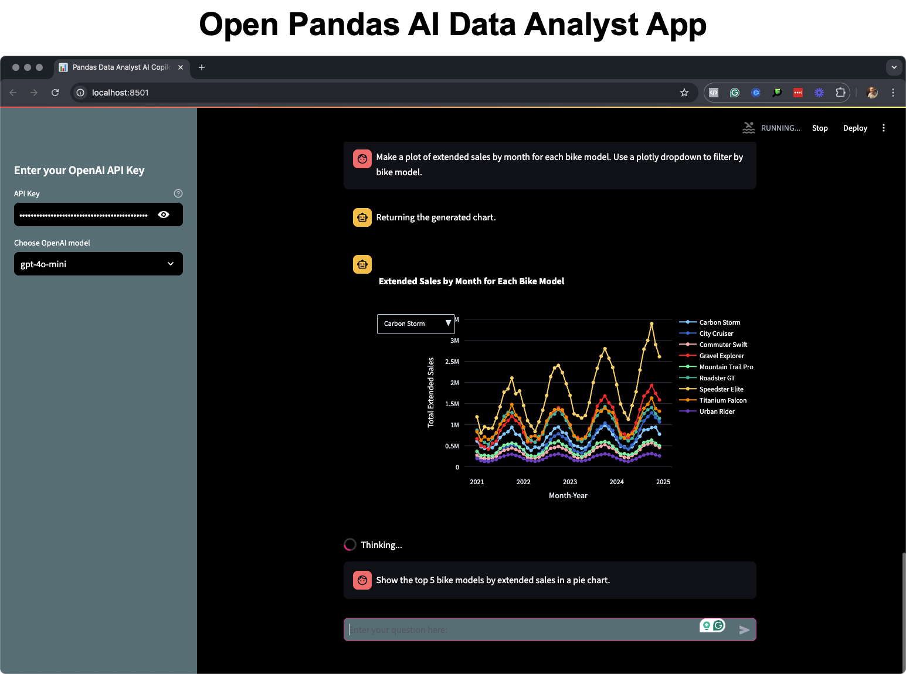
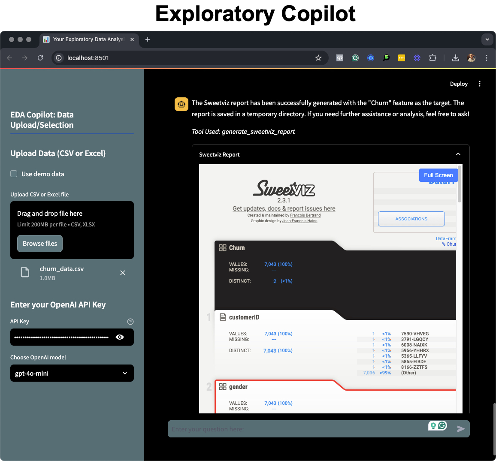
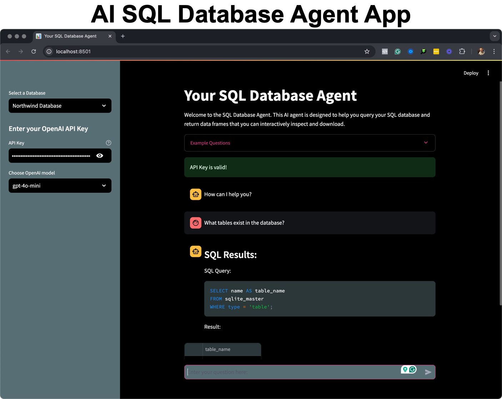

# AI-Powered Applications

This repository contains a collection of AI-powered applications that are built using the AI Data Science Team. 

More applications are coming soon! Stay tuned!

## Pandas AI Data Analyst App

Upload an Excel or CSV file and the Pandas AI Data Analyst can summarize data, analyze and return plots and data frames.

## Exploratory Data Analysis Copilot App

This application allows you to perform exploratory data analysis on a dataset. It uses tools to generate EDA reports, missing value analysis, correlation analysis, and more.

## SQL Database App

This application allows you to connect to a SQL database and generate SQL queries from natural language. The application generates the SQL query. The application will display the results of the query in a table format.

